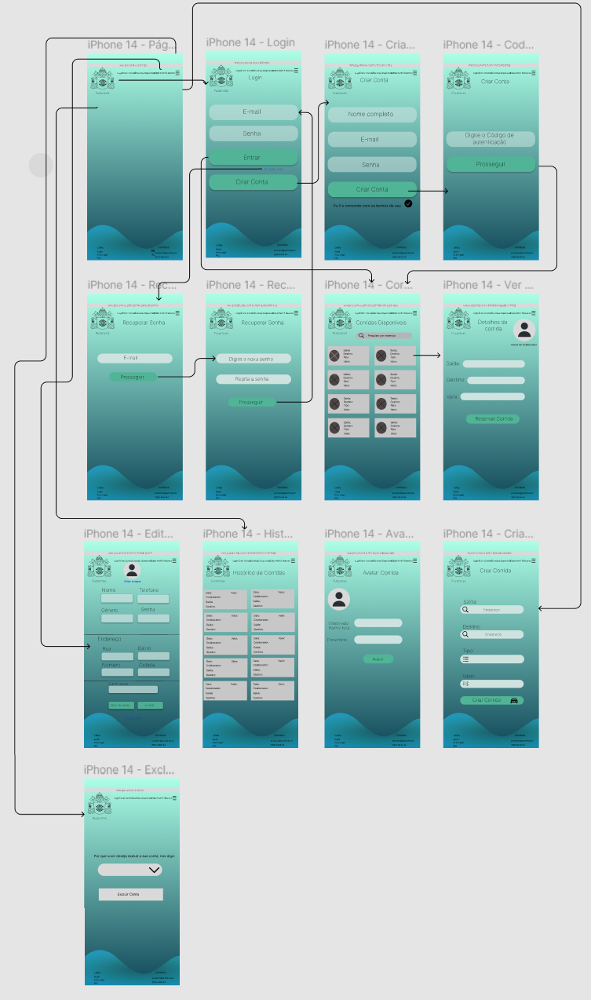
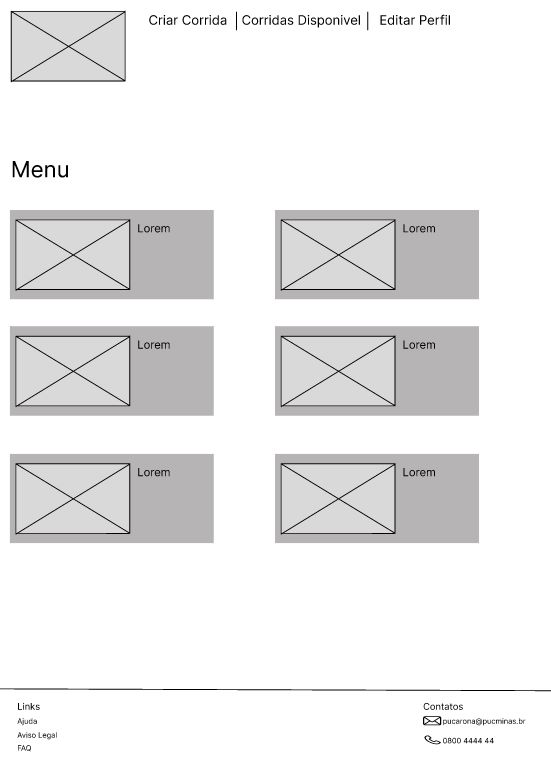

# Projeto de Interface

Visão geral da interação do usuário pelas telas do sistema e protótipo interativo das telas com as funcionalidades que fazem parte do sistema (wireframes).

## User Flow

Figma: https://www.figma.com/file/2n0IpYcIrjdvJ5FcAAut9N/puc-arona-team-library?type=design&node-id=0%3A1&t=PS0hJ7Y8yMLexhGH-1

## Wireframes

Figma: https://www.figma.com/file/DUYCQOVUafmErYUnH4ttic/PUCARONA?type=design&node-id=2%3A432&t=dXEF91ssBc4wswUE-1
