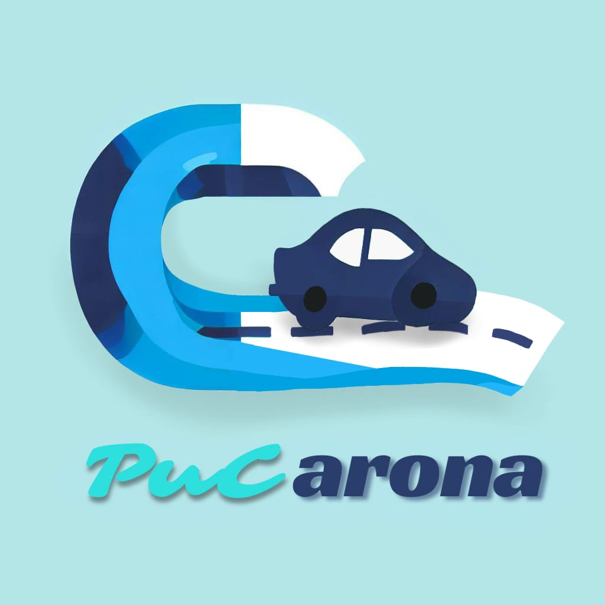

# Apresentação

Faça uma apresentação de um resumo de todos o processo de desenvolvimento e no final apresente a solução desenvolvida, usando um pequeno vídeo.

Liste os arquivos produzidos e postados nesta pasta, com suas localizaçãoes e descrição do conteúdo neste arquivo Readme.md.

* [Pitch inicial](./pucaronaInicio.pdf) -- arquivo com os slides da apresentação inicial
* [Apresentação final](./PUCCARONA-FINAL.pdf) -- arquivo com os slides da apresentação final
* [Vídeo de demonstração](./PUCaronaFinal.mp4) -- arquivo com a demonstração do funcionamento do sistema

## Título do Projeto

* PUCarona

## Identidade Visual (Marca, Design)

A marca foi desenvolvida utilizando as cores da Puc Minas e utilizando o nome da propria

## Vídeo de demonstração

[Vídeo de demonstração](./PUCaronaFinal.mp4)
>#### Link no youtube
https://youtu.be/m-t8X2OcUHs

